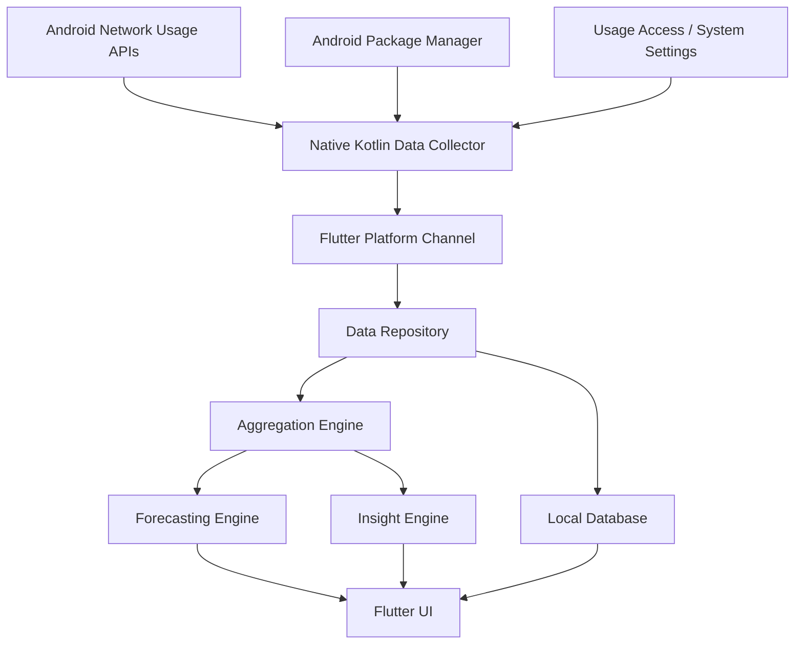

# Jirow Data Insights PRD

## 1. Executive Summary

Jirow Data Insights is an Android-first mobile application that helps users understand, forecast, and optimize their internet consumption through actionable analytics. The MVP focuses on mobile data and WiFi usage visibility, app-level consumption analysis, historical trends, lightweight forecasting, and user-friendly insights.

The product is designed to operate entirely on-device, with no backend, no authentication, no cloud services, no subscriptions, and no telecom integrations. This makes the MVP privacy-preserving, low-cost to operate, and suitable for early validation across users who need better control over mobile data bundles, WiFi usage, and internet spending efficiency.

Jirow Data Insights is intended to become the connectivity analytics module of the broader Jirow Utility Intelligence ecosystem. The MVP should therefore establish a reliable local analytics foundation that can later expand into richer utility intelligence features, telecom partnerships, cloud sync, and cross-device intelligence without requiring those capabilities at launch.

## 2. Product Vision

Jirow Data Insights should become the most understandable personal internet consumption assistant for Android users in data-sensitive markets.

The product vision is to help users answer five practical questions:

- Which apps consume the most internet data?
- How quickly am I using my mobile data bundle?
- What are my daily, weekly, and monthly consumption patterns?
- Am I using data efficiently based on my habits?
- What is likely to happen if my current usage continues?

The long-term vision is for Jirow Data Insights to serve as the connectivity layer of Jirow Utility Intelligence, where internet usage can eventually be correlated with electricity usage, device behavior, household productivity, small business operations, and telecom plan optimization.

## 3. Problem Statement

Smartphone users consume mobile data and WiFi every day, but most lack clear, actionable visibility into their consumption behavior. Existing Android settings show partial usage information, but they are often buried, hard to interpret, and not designed to help users make decisions.

Users commonly struggle to understand:

- Which apps consume the most mobile data and WiFi
- Why bundles are depleted faster than expected
- Whether current usage is normal, increasing, or unusual
- How daily behavior contributes to monthly internet costs
- Whether a bundle will last until the expected renewal date
- What actions they can take to reduce unnecessary consumption

This lack of visibility creates frustration, overspending, disrupted work or study sessions, poor bundle planning, and reduced trust in internet usage management.

Jirow Data Insights solves this by converting raw Android network usage data into simple dashboards, trends, forecasts, and recommendations that users can act on without needing technical knowledge.

## 4. User Personas

### 4.1 Student

**Profile:** A university or secondary-school student who relies on mobile data for online classes, research, social media, messaging, and entertainment.

**Goals:**

- Make limited data bundles last longer
- Identify apps consuming data in the background
- Avoid running out of data during classes or study sessions
- Understand weekly and monthly usage habits

**Pain Points:**

- Limited budget for internet bundles
- Difficulty knowing which app used up data
- Frequent unexpected bundle depletion
- High usage from video, social media, and updates

### 4.2 Remote Worker

**Profile:** A professional who depends on mobile data and WiFi for meetings, collaboration tools, email, cloud documents, and productivity apps.

**Goals:**

- Maintain reliable internet availability for work
- Track work-related and non-work data usage
- Forecast whether current data will last through the month
- Understand heavy usage days and apps

**Pain Points:**

- Video meetings consume large amounts of data
- Hotspot and WiFi switching obscure consumption patterns
- Productivity disruptions when data runs out unexpectedly
- Difficulty estimating monthly internet needs

### 4.3 Content Creator

**Profile:** A creator who uploads, downloads, streams, edits, and shares content across social platforms.

**Goals:**

- Track high-consumption apps and workflows
- Understand upload-heavy and download-heavy days
- Forecast usage before publishing cycles
- Optimize data spending around content production

**Pain Points:**

- Large uploads and video streams deplete bundles quickly
- Inconsistent usage patterns make planning difficult
- App-level usage is important but hard to monitor
- WiFi and mobile data behavior may differ significantly

### 4.4 Small Business Owner

**Profile:** A business owner using a smartphone for sales, messaging, payments, inventory, content marketing, customer support, and hotspot sharing.

**Goals:**

- Understand business internet usage patterns
- Reduce waste from non-essential apps
- Plan monthly data spending more accurately
- Avoid downtime caused by depleted data

**Pain Points:**

- Internet expenses affect business operating costs
- Lack of visibility into what drives data spending
- Difficult to separate business-critical usage from personal usage
- Connectivity disruptions affect revenue and customer service

### 4.5 Secondary Stakeholder: Telecom Operator or Researcher

**Profile:** A future stakeholder interested in aggregated usage behavior, consumer data trends, plan design, or network demand insights.

**Goals:**

- Understand consumer consumption behavior
- Identify usage categories and patterns
- Inform future telecom or research partnerships

**MVP Relevance:** Secondary stakeholders are not directly served by the MVP because the MVP has no cloud infrastructure, user accounts, or data sharing. However, the product architecture should preserve the option to support consent-based aggregation in future releases.

## 5. User Stories

### Dashboard

- As a user, I want to see my total data usage today so that I can understand how much internet I have consumed.
- As a user, I want to see mobile data and WiFi usage separately so that I can distinguish paid bundle usage from WiFi usage.
- As a user, I want to see my top consuming apps immediately so that I can identify the biggest drivers of usage.
- As a user, I want to see whether my usage is higher or lower than usual so that I can adjust my behavior.

### App Consumption Analytics

- As a user, I want to view data usage by app so that I know which apps consume the most internet.
- As a user, I want to compare mobile data and WiFi usage per app so that I can understand app behavior across network types.
- As a user, I want to sort apps by usage so that I can quickly find the highest consumers.
- As a user, I want to open an app detail screen so that I can understand its usage over time.

### Daily Usage Analytics

- As a user, I want to see my usage by day so that I can identify high-consumption days.
- As a user, I want to compare today with yesterday so that I can understand whether my consumption is increasing.
- As a user, I want to see daily usage broken down by mobile data and WiFi so that I can track network-specific behavior.

### Weekly Usage Analytics

- As a user, I want to see my weekly usage trend so that I can understand my routine consumption pattern.
- As a user, I want to compare this week with last week so that I can identify changes in behavior.
- As a user, I want to see the highest usage day of the week so that I can understand when consumption spikes.

### Monthly Usage Analytics

- As a user, I want to see my monthly data usage so that I can plan bundle purchases more accurately.
- As a user, I want to compare the current month with previous months so that I can understand long-term trends.
- As a user, I want to see projected month-end usage so that I can decide whether to reduce usage or buy more data.

### Forecasting

- As a user, I want the app to forecast future usage so that I can know whether my current consumption rate is sustainable.
- As a user, I want to know when I may exceed a target data amount so that I can take action early.
- As a user, I want simple forecast explanations so that I can understand the recommendation without technical language.

### Insight Engine

- As a user, I want plain-language insights so that I do not have to interpret charts manually.
- As a user, I want alerts about unusual usage so that I can detect background consumption.
- As a user, I want recommendations for reducing data consumption so that I can save money.
- As a user, I want insights generated locally so that my usage data remains private.

## 6. Functional Requirements

### 6.1 Dashboard

The dashboard is the primary landing screen and should provide a concise summary of current internet consumption.

**Requirements:**

- Display total usage for the current day.
- Display mobile data usage for the current day.
- Display WiFi usage for the current day.
- Display total usage for the current month.
- Display top 5 apps by total usage for the selected period.
- Display a usage trend indicator, such as "higher than usual", "normal", or "lower than usual".
- Display one to three prioritized insights generated by the insight engine.
- Allow users to switch the dashboard period between today, this week, and this month.
- Refresh usage data when the app opens.
- Provide a visible last-updated timestamp.

**Acceptance Criteria:**

- A user can open the app and understand today's mobile data and WiFi usage within 5 seconds.
- Top consuming apps are visible without requiring deep navigation.
- Dashboard data remains available offline after initial local collection.

### 6.2 App Consumption Analytics

The app analytics feature should show usage by installed application.

**Requirements:**

- List installed apps with data usage values.
- Show total usage per app for a selected date range.
- Separate mobile data and WiFi usage where Android APIs provide sufficient data.
- Sort apps by total usage, mobile usage, WiFi usage, and app name.
- Support time filters: today, yesterday, last 7 days, current month, previous month.
- Show app icon, app name, package name, and usage amount.
- Provide an app detail screen with daily usage trend.
- Identify foreground/background split only if reliably available from Android APIs and permissions; otherwise exclude from MVP UI.

**Acceptance Criteria:**

- Users can identify their highest data-consuming app for the current month.
- Users can compare app-level mobile data and WiFi usage.
- Users can view an individual app's trend over time.

### 6.3 Daily Usage Analytics

Daily analytics should help users understand short-term consumption patterns.

**Requirements:**

- Show daily usage totals for at least the last 30 days.
- Display mobile data, WiFi, and combined usage.
- Highlight the highest usage day in the selected period.
- Compare today with yesterday and with the recent daily average.
- Show daily top apps for selected days.
- Support chart visualization using bar charts or line charts.

**Acceptance Criteria:**

- Users can identify which day had the highest usage in the last 30 days.
- Users can see whether today's usage is above or below their recent average.

### 6.4 Weekly Usage Analytics

Weekly analytics should reveal recurring patterns and week-over-week changes.

**Requirements:**

- Show usage grouped by calendar week.
- Compare current week with previous week.
- Show percentage change week over week.
- Display mobile data and WiFi trends separately.
- Identify highest usage day within the current week.
- Show average daily usage for the selected week.

**Acceptance Criteria:**

- Users can understand whether their current week is trending higher or lower than the previous week.
- Users can identify the weekday with highest consumption.

### 6.5 Monthly Usage Analytics

Monthly analytics should support planning and spending efficiency decisions.

**Requirements:**

- Show monthly usage totals for available local history.
- Compare current month with previous months.
- Show average daily usage for the current month.
- Show projected month-end usage.
- Allow users to set an optional monthly data target in GB.
- Show progress toward the monthly data target.
- Flag when projected usage is likely to exceed the target.

**Acceptance Criteria:**

- Users can view current month usage and projected month-end usage.
- Users can set a monthly data target and track progress against it.

### 6.6 Forecasting

Forecasting should provide understandable predictions based on local usage history.

**Requirements:**

- Forecast end-of-day usage based on current day usage pace and historical daily averages.
- Forecast end-of-week usage based on current weekly usage and historical weekly patterns.
- Forecast end-of-month usage based on average daily usage and remaining days in the month.
- Forecast whether the user is likely to exceed a configured monthly target.
- Forecast the estimated date when a target may be reached.
- Provide confidence labels such as low, medium, or high based on available history.
- Use deterministic local algorithms for MVP; no cloud AI or external model calls.

**Recommended MVP Forecasting Methods:**

- Rolling average over the last 7 days for short-term forecasts.
- Rolling average over the last 30 days for monthly forecasts.
- Weighted average that gives more importance to recent days.
- Simple anomaly dampening to avoid one extreme day dominating projections.

**Acceptance Criteria:**

- Forecasts are generated locally without internet access.
- Forecast text is easy for non-technical users to understand.
- Forecast confidence is reduced when insufficient local history exists.

### 6.7 Insight Engine

The insight engine should transform usage data into plain-language recommendations.

**Requirements:**

- Generate local insights from usage totals, trends, app-level ranking, targets, and forecasts.
- Prioritize insights by importance and usefulness.
- Support at least the following insight types:
  - High usage app insight
  - Unusual daily spike insight
  - Month-end forecast insight
  - Target risk insight
  - WiFi versus mobile data behavior insight
  - Weekly trend insight
  - Data-saving recommendation
- Explain insights in user-friendly language.
- Avoid technical jargon such as package identifiers in user-facing insight text unless shown as secondary metadata.
- Allow users to dismiss an insight.
- Regenerate insights when new usage data is collected.

**Example Insights:**

- "You used 38% more mobile data today than your recent daily average."
- "TikTok is your highest data-consuming app this week."
- "At your current pace, you may reach your 10 GB target by June 24."
- "Your WiFi usage increased this week, which may help reduce mobile bundle pressure."

**Acceptance Criteria:**

- Users receive at least one meaningful insight after sufficient usage data is available.
- Insights are generated without sending data off-device.
- Insight text explains the cause or recommended action.

### 6.8 Permissions and Onboarding

The app must clearly explain required Android permissions and guide the user through setup.

**Requirements:**

- Explain why usage access is needed.
- Guide users to Android Usage Access settings if required.
- Detect whether required permissions have been granted.
- Provide an empty state when permissions are missing.
- Avoid collecting or displaying sensitive personal content.
- Do not require user registration.

**Likely Android Permissions and Access Requirements:**

- Usage Access permission for app usage visibility.
- Network usage access through Android platform APIs where available.
- Package visibility queries for installed apps, subject to Android version requirements.
- Optional notification permission only if MVP includes local reminders or alerts.

**Acceptance Criteria:**

- Users understand why permissions are requested before being sent to system settings.
- App functionality is gracefully limited when permissions are denied.

### 6.9 Settings

Settings should support local preferences needed for analytics and forecasting.

**Requirements:**

- Set monthly data target.
- Set billing or bundle renewal day.
- Choose preferred data unit display: MB or GB.
- Toggle local insight notifications if notifications are included.
- Clear local app data.
- View privacy explanation.

**Acceptance Criteria:**

- Users can configure their monthly target and renewal cycle.
- Users can clear locally stored analytics data.

## 7. Non-Functional Requirements

### 7.1 Privacy

- All usage data must remain on-device in the MVP.
- No personal usage data should be transmitted to external servers.
- No cloud analytics SDK should be included in the MVP unless explicitly approved in a later phase.
- The app should provide clear privacy messaging explaining local-only processing.

### 7.2 Performance

- Dashboard should load within 2 seconds on mid-range Android devices after local data exists.
- Background data collection should minimize battery usage.
- Aggregation jobs should avoid excessive polling.
- App-level analytics screens should remain responsive with hundreds of installed apps.

### 7.3 Reliability

- Usage history should persist across app restarts.
- The app should handle permission revocation gracefully.
- Data collection should recover after device reboot where Android allows scheduled work.
- Forecasting should avoid presenting high confidence when history is insufficient.

### 7.4 Offline Operation

- All MVP features must work without internet connectivity.
- No backend dependency should block app launch, analytics, forecasting, or insights.
- Local storage should be the source of truth.

### 7.5 Security

- Local database should not store unnecessary sensitive information.
- If feasible, local storage should use platform-supported encryption for sensitive preferences.
- The app should avoid logging detailed app usage data in production logs.

### 7.6 Accessibility

- Support readable font sizes and Android accessibility scaling.
- Use sufficient color contrast for charts and labels.
- Do not rely on color alone to communicate usage status.
- Provide text summaries for charts.

### 7.7 Compatibility

- Target Android only for MVP.
- Build UI in Flutter.
- Implement Android usage data collection through native Kotlin code exposed to Flutter via platform channels.
- Define supported Android API levels after validating NetworkStatsManager and usage access behavior across versions.

## 8. Technical Architecture

### 8.1 Architecture Overview

Jirow Data Insights should use a Flutter application layer with Android native services for usage data access. The MVP should use local storage as the system of record and should separate collection, aggregation, forecasting, insights, and presentation concerns.

### 8.2 Recommended Technology Stack

**Mobile Framework:** Flutter  
**Android Native Layer:** Kotlin  
**Local Storage:** SQLite through Drift or sqflite  
**State Management:** Riverpod, Bloc, or another team-standard Flutter state management approach  
**Charts:** fl_chart or a similar Flutter charting package  
**Background Work:** Android WorkManager through native Kotlin integration or Flutter-compatible wrapper  
**Permissions Flow:** Android intent-based navigation to Usage Access settings  

### 8.3 Data Collection Layer

The data collection layer is responsible for retrieving usage data from Android.

**Responsibilities:**

- Query network usage by time window.
- Query app metadata such as name, icon, and package name.
- Map Android UID/package data to installed applications.
- Distinguish mobile data and WiFi usage where supported.
- Handle API limitations across Android versions.
- Return normalized usage records to Flutter.

**Implementation Notes:**

- Use Android NetworkStatsManager where available for network usage summaries.
- Use TrafficStats only where appropriate, recognizing its limitations for historical and per-app usage.
- Use PackageManager to resolve app names and icons.
- Use native Kotlin for API calls that are not cleanly exposed through Flutter packages.
- Expose data to Flutter using MethodChannel or Pigeon-generated platform interfaces.

### 8.4 Local Data Model

The MVP should store normalized usage snapshots and aggregated summaries locally.

**Core Entities:**

#### AppEntity

- id
- packageName
- appName
- iconReference or cached icon path
- uid
- isSystemApp
- firstSeenAt
- lastSeenAt

#### UsageRecord

- id
- packageName
- uid
- networkType: mobile, wifi, unknown
- startTime
- endTime
- bytesReceived
- bytesSent
- totalBytes
- collectedAt

#### DailyUsageSummary

- date
- packageName nullable for all-app totals
- mobileBytes
- wifiBytes
- totalBytes
- createdAt
- updatedAt

#### WeeklyUsageSummary

- weekStartDate
- weekEndDate
- packageName nullable for all-app totals
- mobileBytes
- wifiBytes
- totalBytes

#### MonthlyUsageSummary

- month
- year
- packageName nullable for all-app totals
- mobileBytes
- wifiBytes
- totalBytes
- projectedTotalBytes

#### UserPreference

- monthlyDataTargetBytes
- renewalDay
- preferredUnit
- insightsEnabled
- notificationsEnabled

#### Insight

- id
- type
- title
- body
- severity: info, warning, critical
- relatedPackageName nullable
- generatedAt
- dismissedAt nullable

### 8.5 Aggregation Engine

The aggregation engine transforms raw usage records into daily, weekly, monthly, and app-level summaries.

**Responsibilities:**

- Aggregate records by date, week, month, app, and network type.
- Calculate period-over-period change.
- Calculate daily average usage.
- Identify top-consuming apps.
- Identify unusual spikes relative to historical averages.
- Provide normalized data to UI, forecasting, and insights.

### 8.6 Forecasting Engine

The forecasting engine should use local deterministic calculations.

**MVP Inputs:**

- Current day usage
- Last 7 days usage
- Last 30 days usage
- Current month-to-date usage
- Monthly target, if set
- Renewal day, if set

**MVP Outputs:**

- Projected end-of-day usage
- Projected end-of-week usage
- Projected month-end usage
- Estimated target exhaustion date
- Forecast confidence level

**Confidence Rules:**

- Low confidence: fewer than 7 days of history
- Medium confidence: 7 to 29 days of history
- High confidence: 30 or more days of history

### 8.7 Insight Engine

The insight engine should be rules-based for the MVP.

**Example Rules:**

- If today's usage is more than 30% above the 7-day daily average, generate a usage spike insight.
- If one app accounts for more than 40% of weekly mobile data usage, generate a top app insight.
- If projected monthly usage exceeds the target by more than 10%, generate a target risk insight.
- If WiFi usage increased while mobile usage decreased, generate a positive WiFi optimization insight.
- If current month usage is trending above last month by more than 20%, generate a monthly trend insight.

### 8.8 Background Processing

The MVP should collect and refresh usage data at reasonable intervals without draining battery.

**Recommended Behavior:**

- Refresh on app open.
- Schedule periodic background collection using WorkManager.
- Use conservative collection frequency, such as every 6 to 12 hours.
- Recompute summaries after collection.
- Recompute insights after aggregation.

### 8.9 UI Information Architecture

Recommended primary navigation:

- Dashboard
- Apps
- Trends
- Forecast
- Settings

Recommended screens:

- Onboarding and permission setup
- Dashboard
- App consumption list
- App detail
- Daily analytics
- Weekly analytics
- Monthly analytics
- Forecast detail
- Insights list
- Settings
- Privacy explanation

## 9. MVP Scope

### 9.1 Included in MVP

- Android-only mobile application
- Flutter UI
- Native Android usage data collection
- Local-only storage
- Dashboard
- App-level consumption analytics
- Daily usage analytics
- Weekly usage analytics
- Monthly usage analytics
- Forecasting
- Rules-based insight engine
- Permission onboarding
- Local preferences
- Optional local-only notifications for insights or usage target warnings

### 9.2 Excluded from MVP

- AWS or any cloud infrastructure
- User accounts
- Authentication
- Payment systems
- Subscriptions
- AI chatbots
- Telecom integrations
- Multi-device sync
- Web app
- iOS app
- Cloud backup
- Cross-user benchmarking
- Remote configuration
- Server-side analytics

### 9.3 MVP Release Criteria

The MVP is releasable when:

- Users can grant required Android access and successfully view data usage.
- Dashboard shows current mobile data, WiFi, and total usage.
- App-level analytics identify top-consuming apps.
- Daily, weekly, and monthly views display historical trends.
- Forecasting produces local projections with confidence labels.
- Insight engine generates useful local insights.
- All core functionality works offline.
- The app does not require accounts, backend services, subscriptions, or telecom integrations.

## 10. Future Roadmap

### Phase 1: MVP Validation

- Launch Android-only local analytics MVP.
- Validate data collection reliability across Android versions.
- Validate dashboard clarity and insight usefulness.
- Improve forecasting based on user feedback.
- Add stronger empty states and education around Android permissions.

### Phase 2: Optimization and Personalization

- Smarter user-configurable data plans and bundle types.
- Category-level usage, such as social, video, work, messaging, and system.
- More granular alerts and local recommendations.
- Improved anomaly detection.
- Data-saving playbooks for common app categories.
- Export local reports as CSV or PDF.

### Phase 3: Jirow Utility Intelligence Integration

- Integrate with broader Jirow utility modules.
- Correlate connectivity patterns with electricity, device usage, or productivity signals.
- Introduce optional user profile capabilities if the ecosystem requires them.
- Add privacy-preserving consent flows for ecosystem features.

### Phase 4: Cloud and Sync Capabilities

- Optional account creation.
- Optional encrypted cloud backup.
- Multi-device sync.
- Cross-device usage intelligence.
- Remote configuration for insight rules.

### Phase 5: Telecom and Enterprise Opportunities

- Telecom bundle recommendation partnerships.
- SME dashboards and team-level connectivity reports.
- Research datasets with explicit consent and aggregation.
- Operator-facing insights for plan design and customer education.

## 11. Success Metrics

### 11.1 Product Adoption Metrics

- App installs
- Permission setup completion rate
- First dashboard view completion rate
- Day 1, Day 7, and Day 30 retention
- Percentage of users setting a monthly target

### 11.2 Engagement Metrics

- Average dashboard views per week
- App analytics screen views per user
- Forecast screen views per user
- Insight interaction rate
- Percentage of users dismissing, saving, or acting on insights, if action tracking is implemented locally

### 11.3 Utility Metrics

- Percentage of users who identify a top-consuming app
- Percentage of users who set or adjust monthly targets
- Percentage of users whose usage decreases after receiving high-usage insights
- Forecast accuracy compared with actual month-end usage
- Reduction in unexpected target exceedance after forecast warnings

### 11.4 Technical Metrics

- Dashboard load time
- Data collection success rate
- Permission error rate
- Local database error rate
- Background job completion rate
- Crash-free session rate

### 11.5 Privacy and Trust Metrics

- Percentage of users who complete onboarding after reading permission explanation
- Permission revocation rate
- Support complaints related to privacy concerns
- User-reported trust and clarity scores from surveys

## 12. Risks and Mitigations

### 12.1 Android API Limitations

**Risk:** Android network usage APIs may vary across device manufacturers, Android versions, and permission states.

**Mitigation:**

- Validate API behavior across common Android versions and OEM devices.
- Implement graceful degradation where app-level or network-type data is unavailable.
- Clearly communicate permission requirements and limitations.
- Keep data collection logic isolated in a native layer for easier updates.

### 12.2 Permission Friction

**Risk:** Users may not grant Usage Access or may abandon setup when sent to Android settings.

**Mitigation:**

- Provide clear pre-permission education.
- Use simple language explaining the value of access.
- Detect permission state and guide users back after settings changes.
- Provide useful empty states rather than dead ends.

### 12.3 Inaccurate Forecasts with Limited History

**Risk:** Forecasts may be misleading when the app has little usage history.

**Mitigation:**

- Display confidence labels.
- Use conservative language for early forecasts.
- Require minimum history thresholds for certain insights.
- Improve forecasts as more local history becomes available.

### 12.4 Battery and Performance Concerns

**Risk:** Frequent background collection or heavy aggregation may affect device performance.

**Mitigation:**

- Use conservative WorkManager schedules.
- Refresh on app open rather than constantly polling.
- Aggregate incrementally where possible.
- Profile performance on mid-range Android devices.

### 12.5 User Misunderstanding of Data Units

**Risk:** Users may not understand MB, GB, or how usage maps to app behavior.

**Mitigation:**

- Use clear formatting and human-readable units.
- Provide plain-language insights.
- Include chart summaries and contextual comparisons.
- Avoid overwhelming users with raw technical data.

### 12.6 Privacy Concerns

**Risk:** Users may worry that app usage data is being monitored or uploaded.

**Mitigation:**

- Make local-only processing a prominent trust principle.
- Avoid cloud SDKs in MVP.
- Provide a privacy explanation screen.
- Allow users to clear local data.

### 12.7 Device Manufacturer Differences

**Risk:** OEM-customized Android versions may restrict background work or usage access behavior.

**Mitigation:**

- Test on a representative device matrix.
- Prefer refresh-on-open as a reliable baseline.
- Treat background updates as helpful but not required for core functionality.
- Provide last-updated timestamps so users understand data freshness.

### 12.8 Scope Creep

**Risk:** Requests for telecom integration, accounts, AI chatbots, or payments could delay MVP validation.

**Mitigation:**

- Maintain strict MVP boundaries.
- Track excluded features in the roadmap.
- Prioritize reliable local analytics before ecosystem expansion.
- Use release criteria to protect the MVP from unnecessary dependencies.

